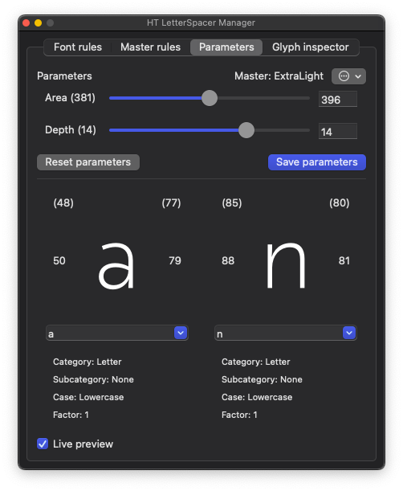

# HTLS Manager (Alpha)
This plugin is the central hub for your [HT Letterspacer](https://letterspacer.huertatipografica.com) setup.

Features:
- Easily manage font spacing rules
- Add per-master adjustments to font spacing rules
- Import _autospace.py files from old HTLS projects
- Export font spacing rules to _autospace.py files
- Set up profiles to re-use spacing rules in your projects
- Copy parameters between masters
- Adjust parameters with a live preview
- Interpolate parameters between masters
- View information on current glyph

Todo:
- Expand functionality for separate writing systems
- accomodate paramOver (?)

Known bugs:
- Changing the frontmost font can result in crashes and unexpected behaviour. Still trying to figure out how to deal with this.

